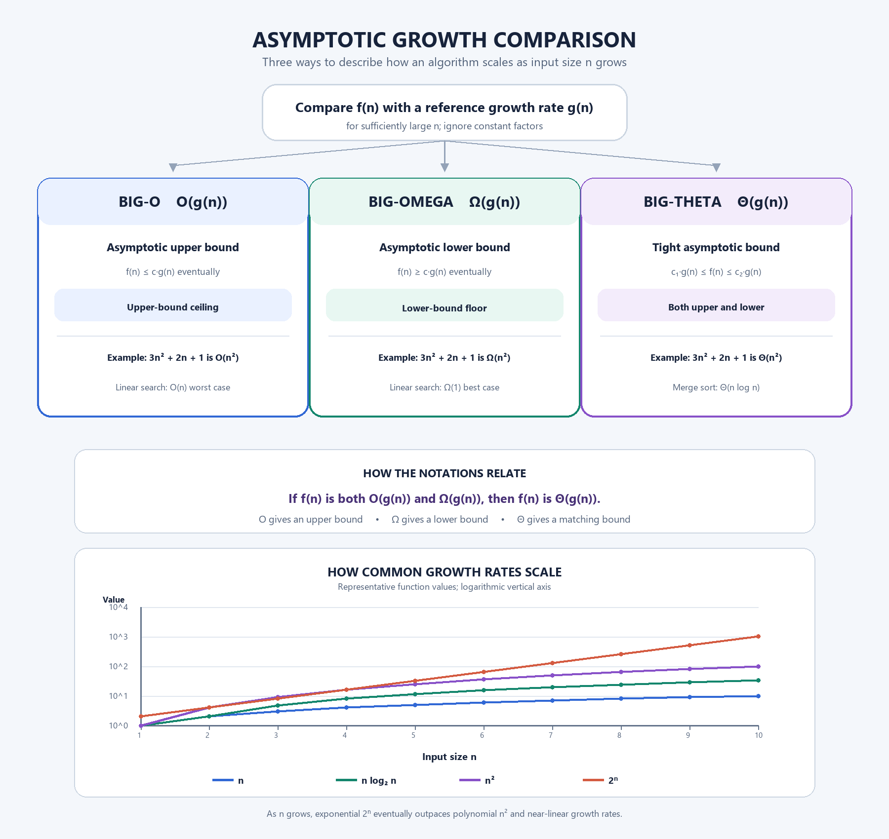

# Asymptotic Growth Comparison

## Description

This project compares Big-O, Big-Omega, and Big-Theta notation in an infographic and adds a log-scale graph of common growth rates. It explains how each notation bounds an algorithm's growth as input size `n` becomes large, and connects the definitions to polynomial and algorithm examples.

## Algorithm

The infographic and growth graph are produced by a short Python drawing program. The graph plots representative values of `n`, `n log2(n)`, `n^2`, and `2^n` for `n = 1..10`; its vertical axis is logarithmic. Its underlying notation comparison is:

```text
Given a running-time function f(n) and a reference function g(n):
  Big-O:     find positive c and n0 such that f(n) <= c*g(n) for n >= n0
  Big-Omega: find positive c and n0 such that f(n) >= c*g(n) for n >= n0
  Big-Theta: find positive c1, c2, and n0 such that
             c1*g(n) <= f(n) <= c2*g(n) for n >= n0
```

Equivalently, a function is `Theta(g(n))` when it is both `O(g(n))` and `Omega(g(n))`. For `f(n) = 3n^2 + 2n + 1`, the dominant term is `n^2`, so the function is `O(n^2)`, `Omega(n^2)`, and therefore `Theta(n^2)`. Merge sort runs in `Theta(n log n)`; linear search has `O(n)` worst-case and `Omega(1)` best-case time.

## Prompt Used

See [Prompt.txt](Prompt.txt) for the complete prompt used to guide the visualization's content and layout.

## Output



The visualization is generated by [Project3_AsymptoticGrowth.py](Project3_AsymptoticGrowth.py). Run it with Python and Pillow installed:

```bash
python Project3_AsymptoticGrowth.py
```

## Learning Outcome

- Distinguished asymptotic upper, lower, and tight bounds.
- Connected formal inequalities to familiar algorithm examples.
- Used a generated concept map to show how the three notations relate.
