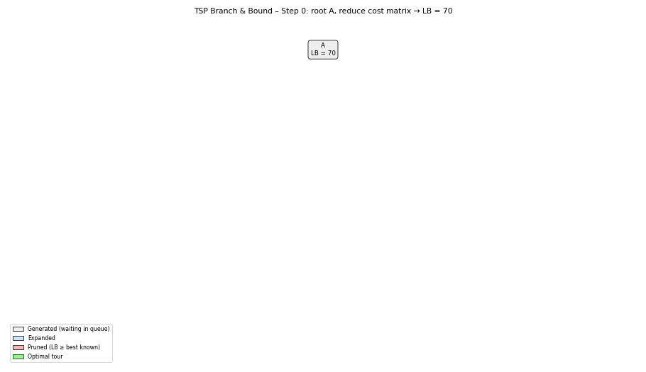
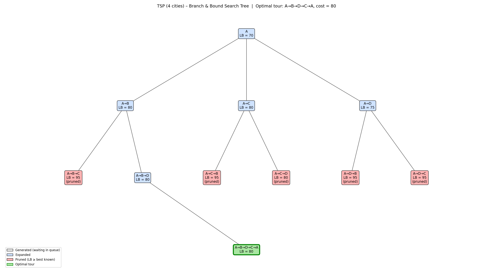

# Project 14: TSP Branch-and-Bound Search Tree

## Description

This project solves the Traveling Salesperson Problem (TSP) for 4 cities using Branch and Bound with the reduced cost matrix lower bound, and visualizes the search tree, showing the bound of every node and which branches are pruned. The visualization was produced through prompt engineering and is provided as a step-by-step animation and a final tree image.

- **Unit:** V, Branch and Bound
- **Problem:** Traveling Salesperson Problem (shortest tour visiting every city once and returning to the start)
- **Time complexity:** O(n!) in the worst case; pruning removes most branches in practice
- **Space complexity:** O(n²) per node for the cost matrix

## Algorithm

### Pseudocode

```
Reduce(M):                          // returns the reduction cost
    total ← 0
    for each row i:    r ← min(M[i]);    if 0 < r < ∞: subtract r from row i;    total += r
    for each column j: c ← min(M[·][j]); if 0 < c < ∞: subtract c from column j; total += c
    return total

TSP_BranchAndBound(C, n):
    M ← copy of C
    root.bound ← Reduce(M);  root.path ← [start];  UB ← ∞
    PQ ← min-priority queue ordered by bound;  insert root
    while PQ not empty:
        node ← PQ.extractMin()
        if node.bound ≥ UB:  prune node;  continue
        i ← last city of node.path
        for each unvisited city j:
            M' ← copy of node.matrix
            child.bound ← node.bound + M'[i][j]
            set row i and column j of M' to ∞;  set M'[j][start] ← ∞
            child.bound ← child.bound + Reduce(M')
            if child.path covers all n cities:   UB ← min(UB, child.bound)
            else if child.bound < UB:            PQ.insert(child)
            else:                                prune child
    return UB and the best tour
```

### Bound formula

```
bound(child) = bound(parent) + M[i][j] + reduction(M')
```

The bound of a node is a lower bound on the cost of any tour that begins with that node's path. If it is already at least the best complete tour found, the node cannot improve the answer and is pruned.

## Prompt Used

"Draw a search tree showing bounding and pruning for TSP with 4 cities."

See [Prompt.txt](Prompt.txt) for all prompts used, including refinements.

## Input Graph

Undirected weighted graph with 4 cities, start city A:

| Edge | Cost |
| ---- | ---- |
| A – B | 10 |
| A – C | 15 |
| A – D | 20 |
| B – C | 35 |
| B – D | 25 |
| C – D | 30 |

## Output

### Demo



### Final search tree



Colors: **grey** = generated and waiting, **blue** = expanded, **red** = pruned, **green** = optimal tour.

### Root reduction

Original matrix, rows A to D and columns A to D:

|       | A | B  | C  | D  |
| ----- | - | -- | -- | -- |
| **A** | ∞ | 10 | 15 | 20 |
| **B** | 10 | ∞ | 35 | 25 |
| **C** | 15 | 35 | ∞ | 30 |
| **D** | 20 | 25 | 30 | ∞ |

Row reduction subtracts 10 + 10 + 15 + 20 = 55. Column reduction then subtracts 5 (column C) + 10 (column D) = 15. Root lower bound = 55 + 15 = **70**.

|       | A | B | C  | D |
| ----- | - | - | -- | - |
| **A** | ∞ | 0 | 0  | 0 |
| **B** | 0 | ∞ | 20 | 5 |
| **C** | 0 | 20 | ∞ | 5 |
| **D** | 0 | 5 | 5  | ∞ |

### Bound of every node

| Node | Path | Parent bound | + Edge cost in reduced matrix | + Reduction | = Lower bound | Result |
| ---- | ---- | ------------ | ----------------------------- | ----------- | ------------- | ------ |
| 0 | A | n/a | n/a | n/a | 70 | expanded |
| 1 | A→B | 70 | 0 | 10 | 80 | expanded |
| 2 | A→C | 70 | 0 | 10 | 80 | expanded |
| 3 | A→D | 70 | 0 | 5 | 75 | expanded |
| 4 | A→D→B | 75 | 0 | 20 | 95 | pruned |
| 5 | A→D→C | 75 | 0 | 20 | 95 | pruned |
| 6 | A→B→C | 80 | 10 | 5 | 95 | pruned |
| 7 | A→B→D | 80 | 0 | 0 | 80 | expanded |
| 8 | A→C→B | 80 | 10 | 5 | 95 | pruned |
| 9 | A→C→D | 80 | 0 | 0 | 80 | pruned |
| 10 | A→B→D→C→A | 80 | 0 | 0 | 80 | **optimal tour** |

### Step-by-step log

```
Step 0: root A, reduce cost matrix → LB = 70
Step 1: expand A (LB=70)        → A→B=80, A→C=80, A→D=75
Step 2: expand A→D (LB=75)      → A→D→B=95, A→D→C=95
Step 3: expand A→B (LB=80)      → A→B→C=95, A→B→D=80
Step 4: expand A→C (LB=80)      → A→C→B=95, A→C→D=80
Step 5: expand A→B→D (LB=80)    → A→B→D→C=80 | complete tour found, best = 80
Step 6: pop A→C→D (80 ≥ 80)     → PRUNED
Step 7: pop A→D→B (95 ≥ 80)     → PRUNED
Step 8: pop A→D→C (95 ≥ 80)     → PRUNED
Step 9: pop A→B→C (95 ≥ 80)     → PRUNED
Step 10: pop A→C→B (95 ≥ 80)    → PRUNED
```

**Result:** optimal tour **A → B → D → C → A** with cost **80** (10 + 25 + 30 + 15).

## Explanation of Logic and Visualization

**Algorithm logic.** Branch and Bound builds the tour one city at a time. Each tree node is a partial path, and its lower bound comes from the reduced cost matrix: every row and column of the remaining matrix must contribute at least its minimum, so the reduction total plus the cost of the path so far can never exceed the real cost of any completion. The node with the smallest bound is always expanded next (best-first). When a complete tour is found its cost becomes the upper bound, and every node whose lower bound is greater than or equal to that value is pruned.

**Why the search stops early.** The first complete tour (A→B→D→C→A, cost 80) is found at step 5, and its cost equals the lower bound of the root's best branch. All five unexpanded nodes have bounds of 80 or more, so none can produce a cheaper tour and they are pruned without exploring their children.

**How the visualization shows the search.** Each box shows the path and its lower bound (LB). The animation adds nodes in the exact order the algorithm processes them, with a caption for each step. Boxes turn blue when expanded, red when pruned, and the final optimal tour is outlined in green.

## How to Run

```
pip install matplotlib pillow
python Project14_TSP_BnB.py
```

It prints the bound of every node and the step log, then regenerates `Visualization.png` and `demo.gif`.

## Files

| File | Purpose |
| ---- | ------- |
| `Project14_TSP_BnB.py` | Python implementation that prints every bound and draws the tree |
| `Prompt.txt` | Prompts used to generate the visualization |
| `Visualization.png` | Final search tree image |
| `demo.gif` | Step-by-step animation of the search |
| `README.md` | Project documentation |

## Learning Outcome

- Understood how lower bounds from cost-matrix reduction guide Branch and Bound for TSP.
- Understood best-first expansion and pruning against the best known tour.
- Learned prompt-based visualization for tracking search-tree state.
- Practiced GitHub documentation.
