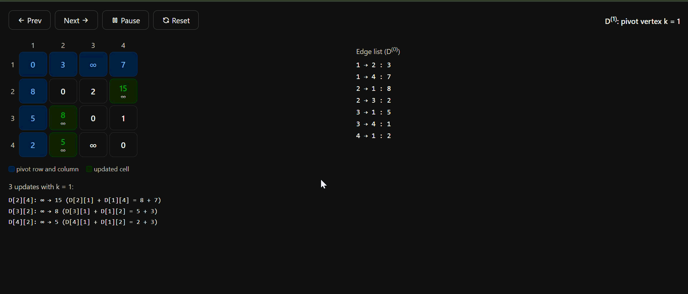

# Project 8: All-Pairs Shortest Path Matrix Update (Floyd-Warshall)

## Description

This project implements the Floyd-Warshall algorithm in C and visualizes how the distance matrix changes at every iteration (D⁽⁰⁾ to D⁽⁴⁾) for a 4-vertex directed graph. The visualization was produced through prompt engineering and is provided as an interactive step-by-step page.

- **Unit:** III, Dynamic Programming
- **Problem:** All-pairs shortest paths
- **Time complexity:** O(V³)
- **Space complexity:** O(V²)

## Algorithm

### Pseudocode

```
FloydWarshall(W, V):
    D ← copy of W            // D[i][i] = 0, missing edges = ∞
    for k ← 1 to V:          // pivot (intermediate) vertex
        for i ← 1 to V:
            for j ← 1 to V:
                if D[i][k] + D[k][j] < D[i][j]:
                    D[i][j] ← D[i][k] + D[k][j]
    return D
```

### Recurrence

```
D(k)[i][j] = min( D(k-1)[i][j],  D(k-1)[i][k] + D(k-1)[k][j] )
```

D⁽ᵏ⁾[i][j] is the shortest path length from i to j that uses only vertices 1 to k as intermediate vertices.

## Prompt Used

"Show iterative updates of distance matrix in Floyd-Warshall algorithm."

See [Prompt.txt](Prompt.txt) for all prompts used, including refinements.

## Input Graph

Directed weighted graph with 4 vertices:

| Edge | Weight |
|------|--------|
| 1 → 2 | 3 |
| 1 → 4 | 7 |
| 2 → 1 | 8 |
| 2 → 3 | 2 |
| 3 → 1 | 5 |
| 3 → 4 | 1 |
| 4 → 1 | 2 |

## Output

### Demo



### Interactive visualization

[Open the live Floyd-Warshall stepper](https://YOUR-USERNAME.github.io/YOUR-REPO/Unit3_DynamicProgramming/Visualization.html)

Use Next, Prev, or Auto play to step through D⁽⁰⁾ to D⁽⁴⁾. Blue cells are the pivot row and column for step k, and green cells are the ones that improved. The source file is [Visualization.html](Visualization.html), which can also be downloaded and opened locally.

### Iterative distance matrix updates

Bold cells were updated in that step, with the old value in brackets.

**D⁽⁰⁾: direct edges**

| | 1 | 2 | 3 | 4 |
|---|---|---|---|---|
| **1** | 0 | 3 | ∞ | 7 |
| **2** | 8 | 0 | 2 | ∞ |
| **3** | 5 | ∞ | 0 | 1 |
| **4** | 2 | ∞ | ∞ | 0 |

**D⁽¹⁾: pivot vertex 1 (row 1 and column 1)**

| | 1 | 2 | 3 | 4 |
|---|---|---|---|---|
| **1** | 0 | 3 | ∞ | 7 |
| **2** | 8 | 0 | 2 | **15** (was ∞) |
| **3** | 5 | **8** (was ∞) | 0 | 1 |
| **4** | 2 | **5** (was ∞) | ∞ | 0 |

**D⁽²⁾: pivot vertex 2 (row 2 and column 2)**

| | 1 | 2 | 3 | 4 |
|---|---|---|---|---|
| **1** | 0 | 3 | **5** (was ∞) | 7 |
| **2** | 8 | 0 | 2 | 15 |
| **3** | 5 | 8 | 0 | 1 |
| **4** | 2 | 5 | **7** (was ∞) | 0 |

**D⁽³⁾: pivot vertex 3 (row 3 and column 3)**

| | 1 | 2 | 3 | 4 |
|---|---|---|---|---|
| **1** | 0 | 3 | 5 | **6** (was 7) |
| **2** | **7** (was 8) | 0 | 2 | **3** (was 15) |
| **3** | 5 | 8 | 0 | 1 |
| **4** | 2 | 5 | 7 | 0 |

**D⁽⁴⁾: pivot vertex 4 (row 4 and column 4), final result**

| | 1 | 2 | 3 | 4 |
|---|---|---|---|---|
| **1** | 0 | 3 | 5 | 6 |
| **2** | **5** (was 7) | 0 | 2 | 3 |
| **3** | **3** (was 5) | **6** (was 8) | 0 | 1 |
| **4** | 2 | 5 | 7 | 0 |

## Explanation of Logic and Visualization

**Algorithm logic.** Floyd-Warshall considers each vertex k in turn as an intermediate bridge. For every pair (i, j), if the route i → k → j is shorter than the best distance found so far, the cell D[i][j] is updated. After all V pivots have been processed, every cell holds the true shortest distance. Three nested loops over V vertices give O(V³) time.

**Why pivot row and column are highlighted.** In iteration k, every update depends only on row k and column k of the previous matrix. Because D[k][k] = 0, those two lines do not change during iteration k, so they are highlighted as the inputs to that step.

**How the visualization shows the updates.** Each step shows one matrix. The pivot row and column are shaded blue, and any cell whose value improved is shaded green with the old value struck through. The log below the matrix lists each update with the sum that caused it, for example `D[2][4]: 15 → 3 (D[2][3] + D[3][4] = 2 + 1)`.

## How to Run

Compile and run the C program:

```
gcc Project8_FloydWarshall.c -o floyd
./floyd
```

It prints D⁽⁰⁾ to D⁽⁴⁾ and logs every cell update. To view the visualization, open `Visualization.html` in any browser.

## Files

| File | Purpose |
|------|---------|
| `Project8_FloydWarshall.c` | C implementation that prints each matrix |
| `Prompt.txt` | Prompts used to generate the visualization |
| `Visualization.html` | Interactive step-by-step visualization |
| `demo.gif` | Recorded demo of the visualization |
| `README.md` | Project documentation |

## Learning Outcome

- Understood all-pairs shortest path solving through dynamic programming.
- Understood O(V³) matrix state transformations using intermediate-vertex pivoting.
- Learned prompt-based visualization for tracking algorithm state.
- Practiced GitHub documentation and hosting with GitHub Pages.